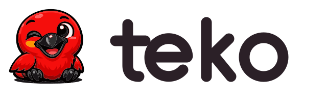

<div align="center">



**A self-hosting, all-native programming language — safe by construction, tested by default.**

[](https://github.com/schivei/teko-lang/actions/workflows/native.yml)
[](https://github.com/schivei/teko-lang/actions/workflows/sanitizers.yml)
[](https://github.com/schivei/teko-lang/actions/workflows/sast.yml)
[](https://github.com/schivei/teko-lang/actions/workflows/codeql.yml)


*Meet **Guri**, our mascot: a baby **guará** (scarlet ibis), a bird endemic to Brazil.*

</div>

---

## What is Teko?

Teko is a compiled, statically-typed programming language with a **fully self-hosting compiler**: the compiler is written in Teko itself and compiles its own source tree to a working native binary — and that binary rebuilds itself to a byte-identical fixpoint (generation 2 == generation 3).

- **All-native output.** `teko build` lowers your program to C and hands it to the host C compiler — no runtime VM, no GC, no interpreter in production binaries. (C is the current lowering target; an own AOT backend is the 0.3 direction, not yet shipped.)
- **Native debug iteration.** `teko run` compiles the same checked program natively under `-O0` and executes it immediately in-process — fast, native debugging with full optimization choice via `-O` flags.
- **Tests are part of the build.** `teko build` runs your `#test` functions **before** codegen; failing tests or a coverage floor below the manifest's threshold **bar the release**. Coverage can be exported as Cobertura XML (`--coverage`).
- **Errors are values.** Functions return `T | error`; the `?` family (`T?`, `?.`, `??`) handles absence. There is no `null` outside `T?`, no exceptions, no `never`.
- **Automatic memory without a GC — with opt-in layers.** Arena regions are the invisible default: allocation and deallocation are compiler-managed, no GC, no borrow-checker ceremony (an *inferred* points-to/uniqueness fact — the "spine", under construction — is what makes stored borrows and manual `mem::free` sound; it is not a borrow checker you write to). On top ship two opt-in layers: `adopt { }` for cyclic or long-lived data (bulk-dropped at the block's brace), and `unsafe` — a **type/function modifier** (full risk ownership by type, not a block scope) — for explicit raw allocation. No `malloc`/`free` in safe code; raw allocation is explicit and contained behind `unsafe`.
- **A deliberately small surface.** One loop construct (`loop` + `break`), `match` for control flow over data, generics via monomorphization, value structs, reference classes, pure-contract interfaces, bitflag `flags`, `extern` FFI to C libraries.

> **Status: pre-release, beta.** The language and compiler are under active, fast-moving development; syntax and semantics can still change between commits. Versioning tracks the remodel: `alpha` (`0.0.1.x`, pre-remodel) → `beta` (the `0.X` remodel/backlog waves, each finalizing one coherent subset) → `1.0.0.0` = LTS once the backlog is empty. The current wave, **`0.1.0.0-beta`**, ships the memory model + `unsafe` (by type) + `adopt`. The compiler is fully self-hosting (gen-2 == gen-3 byte-identical fixpoint). See [TEKO_MASTER_PLAN.md](TEKO_MASTER_PLAN.md) for the live execution roadmap.

## A taste of Teko

```teko
// Errors are values: a function that can fail returns `T | error`.
pub type Box = struct { v: i64 }

fn ok()   -> Box | error { Box { v = 7 } }
fn fail() -> Box | error { error { message = "boom" } }

pub fn classify() -> i64 {
    match ok() {
        Box as b  => b.v      // bind the success member
        error     => 0        // handle the failure member
    }
}
```

```teko
// Optionals: `T?`, safe navigation `?.` and coalescing `??`.
pub fn safe() -> i64 {
    let b: Box? = null
    b?.v ?? 8                 // → 8 (absent → fallback)
}
```

```teko
// Classes are reference types with factories instead of constructors.
type Dog = class {
    pub name: str
    pub age: i64

    pub fn make(n: str, a: i64) -> Dog {
        Dog { name = n; age = a }
    }

    pub fn is_puppy(self) -> bool {
        self.age < 1
    }
}

let rex = Dog::make("Rex", 3)
```

```teko
// String interpolation and the `~` concat operator (literal runs fold at compile time).
let name = "world"
let greeting = $"hi {name}" ~ "!"
```

Programs have a *virtual main*: top-level statements in `main.tks` are the entry point — no boilerplate `fn main` required.

## Quick start

### Prerequisites

- **A released Teko binary** (for bootstrapping; see `scripts/fetch_teko.sh`)
- A **C23-capable compiler** (clang on macOS/Linux; clang with lld on Windows) — used by `teko build` to link generated programs
- A host `cc` on `PATH`

### Build the compiler

```sh
git clone https://github.com/schivei/teko-lang.git
cd teko-lang

./scripts/fetch_teko.sh          # Download the latest released Teko binary
./.teko/teko . -o bin            # Compile the project with the seed → bin/teko (self-hosted binary)
```

Full technical instructions (CI models, targets, gates, troubleshooting): **[docs/BUILDING.md](docs/BUILDING.md)**.

### Use it

```sh
./bin/teko build .            # compile and link the project to a native binary
./bin/teko run .              # debug build and run the project natively (like cargo run)
./bin/teko test .             # run the project's #test functions natively
./bin/teko build . -o out     # choose the output directory
./bin/teko test . --coverage  # emit a Cobertura coverage report
```

A project is any directory with a `*.tkp` manifest (TOML) and a source tree — see [teko.tkp](teko.tkp), the compiler's own manifest, for a commented reference.

## Project layout

| Path | What lives there |
|---|---|
| `src/` | The compiler, in Teko (`.tks`, canonical) — self-hosted, 100% Teko source |
| `src/lexer/ · parser/ · checker/ · codegen/ · emit/` | The pipeline stages: lex → parse → type-check → native C emission (own AOT backend + C backend) → `.tkb`/`.tkh`/`.tkl` artifacts |
| `src/runtime/teko_rt.{h,c}` | The minimal execution runtime linked into generated programs |
| `examples/` | Smoke and regression programs, each verified on native |
| `docs/brand/` | Mascot, logo and icon assets ([brand guide](docs/brand/README.md)) |
| `TEKO_*.md` | The language's design record: constitution, legislation, master plan, roadmaps |

## Documentation

- **[TEKO_MASTER_PLAN.md](TEKO_MASTER_PLAN.md)** — the single ordered execution sequence for all open work (start here for status)
- **[TEKO_CONSTITUTION.md](TEKO_CONSTITUTION.md)** — the laws (M.0–M.5) that govern every design ruling
- **[TEKO_LEGISLATION.md](TEKO_LEGISLATION.md)** — ratified language design decisions
- **[TEKO_SOURCE.md](TEKO_SOURCE.md) / [TEKO_CHECKER.md](TEKO_CHECKER.md)** — the original spec-as-source documents (frozen; `src/` is canonical)
- **[docs/BUILDING.md](docs/BUILDING.md)** — building, testing and verification gates
- **[TEKO_ROADMAP_TOOLING.md](TEKO_ROADMAP_TOOLING.md)** — editor/IDE tooling roadmap (VS Code, JetBrains, Vim, …)

## Contributing

Contributions are welcome — but read **[CONTRIBUTING.md](CONTRIBUTING.md)** first: this project has strong quality standards (W15 doc-comment style, 100% coverage on the delta, native-only verification) that every change must respect.

## The mascot

<p>


</p>

The Teko mascot is **Guri** — a baby **guará** (*Eudocimus ruber*, the scarlet ibis), one of Brazil's most striking endemic birds. *Guri* is southern-Brazilian Portuguese for "little kid", a warm nod to the fledgling and an echo of *gua*rá. All assets, palettes and usage rules are in the [brand guide](docs/brand/README.md).

## License

Dual-licensed under [Apache-2.0](LICENSE-APACHE) or [MIT](LICENSE-MIT), at your option. Unless you explicitly state otherwise, any contribution you intentionally submit for inclusion is dual-licensed the same way, without additional terms.
