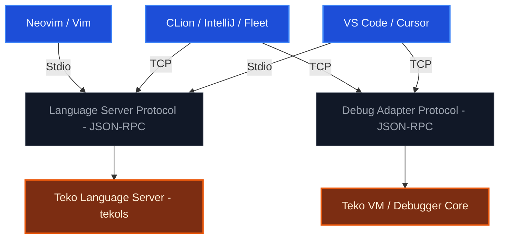
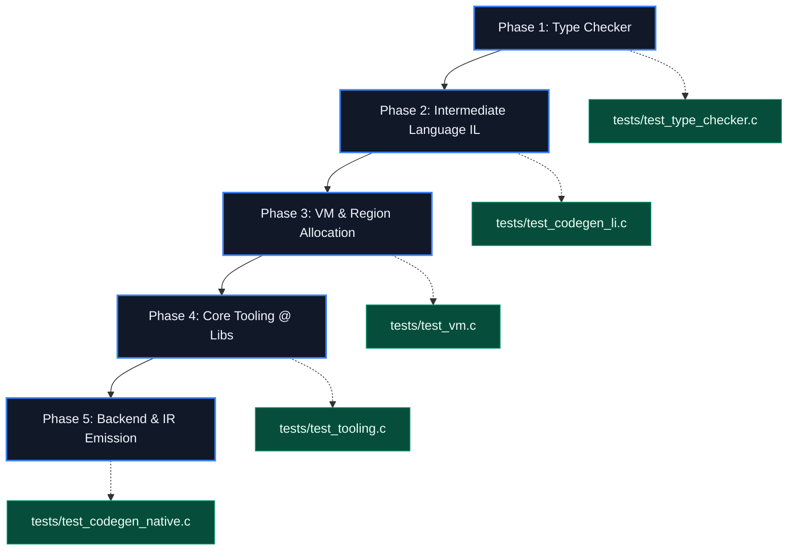

# 🗺️ Technology Tree Plan: The Teko Language

> Action plan updated on 2026-06-14. Phases 1–8 reflect work already delivered/in
> progress. Phase 9 is the Technical Debt Resolution hardening track (from
> `TECH_DEBT_BACKLOG.md`). Phase 10 is the WASM Concurrency Backend feature
> (delivered — merged via PR #3). Phase 11 is the Browser FFI / JS-DOM Interop
> feature (current; `docs/PHASE_BROWSER_FFI.md`). Phases 12–19 were derived from the
> project owner's roadmap memorandum (`TEKO_COMPILER_MEMORANDUM.txt`). The
> Self-Containment (Self-Hosting) milestone is the final phase, 20.

## 📚 Documentation Map

To stop the planning docs from drifting, here is the single source of truth for each topic. **Canonical** docs are kept current; **reference/historical** docs are preserved for context but are not maintained as living plans.

| Document | Role | Status |
|----------|------|--------|
| [`README.md`](../README.md) | Project overview, features, quick start | Canonical (user-facing) |
| **`docs/plan.md`** (this file) | The roadmap — phases 1–20, current status | **Canonical (roadmap)** |
| [`docs/ARCHITECTURE.md`](./ARCHITECTURE.md) | Compiler pipeline & module/file map | **Canonical (architecture)** |
| [`docs/PHASE10_WASM_CONCURRENCY.md`](./PHASE10_WASM_CONCURRENCY.md) | Phase 10 design & implementation (delivered) | Canonical (feature design) |
| [`docs/PHASE_BROWSER_FFI.md`](./PHASE_BROWSER_FFI.md) | Phase 11 design & plan (Browser FFI / JS-DOM interop) | Canonical (feature design) |
| [`TECH_DEBT_BACKLOG.md`](../TECH_DEBT_BACKLOG.md) | Prioritized maintenance backlog | Canonical (tech debt) |
| [`TEKO_COMPILER_MEMORANDUM.txt`](../TEKO_COMPILER_MEMORANDUM.txt) | Owner's checkpoint memorandum; source of phases 12–19 | Reference / historical |
| [`docs/vm_plan.md`](./vm_plan.md) | Phase 3 (VM & debugger) sprint detail | Reference / historical (phase delivered) |
| [`docs/BACKEND_AOT_PLAN.md`](./BACKEND_AOT_PLAN.md) | Phase 5 AOT backend spec (target matrix, ABIs, per-opcode requirements) | Reference (backend spec) |
| [`PITCH.md`](../PITCH.md) / [`PITCH-pt-br.md`](../PITCH-pt-br.md) | Marketing pitch (EN / PT-BR) | Reference |

When in doubt: roadmap questions → this file; "how does the compiler work / where is X" → `ARCHITECTURE.md`; "what should we fix next" → `TECH_DEBT_BACKLOG.md`.





---

## 🛠️ Phase 1: Type Checker
*The frontend must guarantee the code is 100% semantically valid before any translation attempt.*

*   **1.1 Inference and Resolution Algorithm:**
    *   Implement the type unification system for inference on `:=` operators (e.g., `wg := waiter` infers the type `teko::waiter`).
    *   Build the complex-type resolver: nested generics (`map<str, mut i32>`), nullables (`ExternalStructure?`), and function arities (`func<i32, void>`).
*   **1.2 Assignment Checking and Mutability Rules:**
    *   Enforce a barrier against invalid assignments (e.g., trying to put a `LIT_STR` literal into an `i32` type).
    *   Connect the AST to the Symbol Table to lock assignments to immutable `let` variables (e.g., fail on a write to a symbol whose `is_mutable` metadata is `false`).
*   **1.3 Async Flow and Concurrency Validation:**
    *   Validate that `await` expressions are applied strictly to returns wrapped in `intent<T>`.
    *   Verify that traditional `defer` blocks do **not** contain `await` expressions, whereas `async defer` blocks require or allow them.
*   **🧪 Associated Tests (`tests/test_type_checker.c`):**
    *   Unity assertions injecting intentional mutability and incompatible-primitive-type errors, validating that the compiler rejects them.

---

## 💾 Phase 2: Intermediate Language (IL) Architecture and Bytecode Emission
*Definition of a compact, platform-independent instruction format, ideal for portability and for feeding our VM.*

*   **2.1 IL ISA (Instruction Set Architecture) Design:**
    *   Design an instruction set based on virtual registers or a stack (e.g., `ICONST`, `STORE_MUT`, `SPAWN_ASYNC`, `CHAN_PUT`, `AWAIT_INTENT`).
    *   Structure the compiled binary file format (`.tkb` - Teko Bytecode) containing: a header with a Magic Number, a Constants Table (literals, strings), Namespace/Type metadata, and the raw instruction vector (*opcodes*).
*   **2.2 The Bytecode Emitter (IL Codegen):**
    *   Create the `src/codegen_li.c` module that walks the validated AST and translates nodes into linear IL instructions.
    *   Map the inline switch and conditionalized `when` blocks into efficient conditional bytecode branches (`JMP_IF_FALSE`).
*   **🧪 Associated Tests (`tests/test_codegen_li.c`):**
    *   Compile small syntactic snippets and inspect the bytes generated in memory to validate that the *opcodes* match the ISA specification.

---

## 🚀 Phase 3: Development Virtual Machine (VM)
*The agile, portable, cross-platform execution environment for the developer, responsible for running `.tkb` bytecode performantly.*

*   **3.1 The Core Interpreter:**
    *   Implement the main execution loop (`src/vm_core.c`) based on an optimized `switch-case` loop (or label pointers if you prefer to optimize in C23) to process IL opcodes.
    *   Build the Context and Call Stack subsystem isolated per Green Thread / coroutine to support async methods natively.
*   **3.2 The VM Concurrency Engine (Green Threads, Channels, and Semaphores):**
    *   Develop the **M:N Scheduler** (M Green Threads mapped onto N native OS threads via `pthread` or the new C23 threads).
    *   Implement the real internal control structures for sync/async channels, mutual-exclusion locks (`mutex`), and `waiter` counters.
*   **3.3 The Real Region-Based Allocator (Region-Based Memory Management):**
    *   Build the native **Memory Arena** engine (the runtime structure that serves the `ctx: arena` of your `main`). Every internal Green Thread allocation and user program data must be pushed into contiguous arena blocks, ensuring that closing the arena clears gigabytes of garbage instantly via O(1) with no Garbage Collector pausing execution.
*   **🧪 Associated Tests (`tests/test_vm.c`):**
    *   Run bytecodes that open channels, fire concurrent loops, and validate that the Scheduler distributes the load and the Arena clears memory perfectly.

---

## 🧰 Phase 4: Core Tooling & Native Framework (Support for `@`)
*Creating the language's standard library and internal tooling, written in the ecosystem and exposed transparently through the `@` syntactic sugar.*

*   **4.1 Mapping and Linking the Internal Namespaces:**
    *   Create the teko header files (e.g., `strings.tk`, `marshall.tk`, `flows.tk`, `lists.tk`, `logger.tk`).
    *   Structure the **Intrinsics / Builtins** subsystem in the compiler: when the Type Checker intercepts an identifier starting with `@` (which we expand to `teko::`), the compiler knows to link that call directly to the high-performance internal functions implemented in the VM runtime or in pure C (FFI).
*   **4.2 Development of the Mandatory `@` Sub-libraries:**
    *   `@marshall`: Pointer conversion functions (`to_ptr`, `from_ptr`) for conversions between Teko types and native C types (FFI).
    *   `@flows`: Event-driven architectural engine for CQRS (`request`, `notify`, `send`), resolving automatic Handler injection.
    *   `@lists` and `@strings`: Manipulation of mutable arrays, dynamic decimal collections, and optimized concatenations.
*   **4.3 The Compiler CLI Driver:**
    *   Create the main terminal utility (`teko compile`, `teko run`).
    *   Inject the `is_stdlib_compilation` privilege-control flag we created. If the CLI driver compiles the compiler/stdlib folder, it turns the flag on as `true` to allow the use of `teko::`; if it's a third-party project, it strictly forces the use of `@`.
*   **🧪 Associated Tests (`tests/test_tooling.c`):**
    *   Compile code containing `@strings.concat` and verify that the syntactic expansion and runtime memory routing are intact.

---

## 🎛️ Phase 5: Advanced Backend and IR Emission (LLVM / C)
*The definitive production stage. When the user needs maximum execution performance (*Ahead-of-Time*), the compiler skips the VM and generates optimized native binaries.*

*   **5.1 Intermediate Transpilation to Pure C or LLVM IR Emission:**
    *   **Transpile-to-C Approach:** Convert the validated AST or the IL instructions directly into structured C code, mapping Green Threads to the `libuv` library or native async Thread constructs, then invoking the system's local `clang` or `gcc` to produce the final binary executable.
    *   **LLVM IR Approach:** Consume the LLVM API to emit textual `.ll` instructions, leveraging industrial register optimizations and generating native code directly for **arm64** (Mac M1/M2/M3) or **x86_64** (Intel/AMD).
*   **5.2 Type Matching and Fixed FFI Generation:**
    *   Generate the exact translation of complex types described in the `extern struct` block or `extern fn ... from "my.dylib" as "GetMy"`, converting arbitrary Teko strings into traditional C `char*` pointers and binding natively via `dlopen`/`dlsym` or direct linking.
*   **🧪 Associated Tests (`tests/test_codegen_native.c`):**
    *   Generate a final binary of a complete Teko program, run it on the host operating system, and inspect whether the output result and concurrent behavior match the specification.

---

# 🗺️ Strategic Plan: The Teko Compiler — From AOT to Self-Control (Self-Hosting)

This document establishes the definitive technical roadmap for the final development phases of the **Teko** language. The central goal is to transform the ecosystem into a purely **autonomous and self-sufficient** systems-level infrastructure, completely eliminating any dependency on third-party compilers and linkers (Clang, GCC, MSVC, Link.exe), and empowering the compiler to generate bare-metal executables directly by writing the structural bytes of operating-system binary files.

---

## 🏗️ Architectural Journey Overview

```
┌──────────────────────────────┐
│  PHASE 6: GLOBAL OPTIMIZATIONS│ ➔ Constant Folding, Inlining, and Flow Analysis      [DONE]
└──────────────┬───────────────┘
               ▼
┌──────────────────────────────┐
│  PHASE 7: LINKER ENGINEERING  │ ➔ Direct ELF, Mach-O, and PE/COFF generation         [IN PROGRESS]
└──────────────┬───────────────┘
               ▼
┌──────────────────────────────┐
│  PHASE 8: EMBEDDED RUNTIME    │ ➔ Direct Syscalls, Virtual Arena Allocator, Threads  [VALIDATED]
└──────────────┬───────────────┘
               ▼
┌──────────────────────────────┐
│  PHASE 9: TECHNICAL DEBT      │ ➔ Build hardening, test coverage, WASM MVP, de-duplication
└──────────────┬───────────────┘
               ▼
┌──────────────────────────────┐
│  PHASE 10: WASM CONCURRENCY   │ ➔ Cooperative + wasm-threads backend (delivered — PR #3)
└──────────────┬───────────────┘
               ▼
┌──────────────────────────────┐
│  PHASE 11: BROWSER FFI/JS-DOM │ ➔ extern→imports, string-pool data, JS/DOM interop (current)
└──────────────┬───────────────┘
               ▼
┌──────────────────────────────┐
│  PHASES 12–19: LANG SURFACE   │ ➔ Grammar, Concurrency, OOP, Optionals, Web/Crypto,
│  (from the Memorandum roadmap)│   Parsers/Templates, Interop, Native Testing
└──────────────┬───────────────┘
               ▼
┌──────────────────────────────┐
│  PHASE 20: SELF-CONTAINMENT   │ ➔ Compiler Bootstrapping (Rewrite from C to Teko)
└──────────────────────────────┘
```

---

## 🚀 PHASE 6: Global Optimizations of the Metal Backend — *Done*
Phase 6 focuses on expanding the static analysis and reordering engine of the Intermediate Language (IL) in the central orchestrator before dispatching instructions to the CPUs.

### 1. Constant Folding
*   **Mechanics:** The optimizer runs a predictive sweep looking for arithmetic operations whose operands are literals known at compile time (e.g., `OP_ICONST 10`, `OP_ICONST 5`, `OP_ADD`).
*   **Application on Silicon:** The compiler collapses the instructions at build time, computing the result and emitting a single clean load instruction (`OP_ICONST 15`), saving clock cycles at runtime.

### 2. Automatic Static Function Inlining
*   **Mechanics:** The compiler analyzes the control graph looking for small subroutines (small-bytecode "leaf" functions that make no calls to third parties).
*   **Application on Silicon:** The physical branch opcode (`bl`, `call`, `jal`) is replaced directly with a faithful copy of the function body. This eliminates the physical cost of stack frames, Link Register preservation, and pipeline flushes, unlocking the full potential of CSE and DCE in the expanded block.

---

## 🛠️ PHASE 7: Static Native Linker Engineering (`tld`) — *In Progress*
Phase 7 eliminates the call to the host system's `system()` command. The Teko compiler will communicate with kernels by writing the executable binary formats directly to disk.

### 1. Direct Writing of Object Formats and Executable Headers
The backend will abandon textual assembly code generation (.s/.asm) and implement binary emitters to inject the structural metadata tables:
*   **Linux / FreeBSD (ELF64 formats):** Direct writing of ELF headers (`Elf64_Ehdr`), program header sections (`Elf64_Phdr`), and the ELF note marks required by BSD kernel validators.
*   **macOS (Mach-O format):** Writing of architecture headers (`mach_header_64`) and segment load commands (`segment_command_64`).
*   **Windows (PE/COFF format):** Writing of the DOS and NT Header structures (`IMAGE_DOS_HEADER`, `IMAGE_NT_HEADERS`).

### 2. Symbol Resolution and Relocation Mechanism (*The Linking Engine*)
*   **Symbol Resolution:** Map cross-global references, linking the programmer-generated code to the static data sections (`.rodata`/`.rdata`).
*   **Relocation Offsets:** Compute offsets and patch, at link time, the virtual addresses of long conditional jumps (`JMP`) and runtime calls, cementing total independence from external infrastructure.

---

## 🧵 PHASE 8: The Embedded Native Runtime (*Teko Core Runtime*) — *Validated*
To support the native features of massive M:N concurrency, blocking channels, and scope promotion via escape analysis, the language embeds its own low-level static runtime written bare-metal.

### 1. Native Cooperative M:N Concurrency Subsystem
*   **Unix-Like:** Ingest pure system calls via assembly instructions (`syscall` / `svc` / `ecall`), invoking the clone syscall (`sys_clone` on Linux) or native FreeBSD thread management (`thr_new`) to orchestrate the cooperative Green Thread scheduler without loading C's standard libc.
*   **Windows:** Clean static linkage oriented to the export pointers of the `kernel32.dll` bus APIs (such as `CreateThread` and atomic primitives).

### 2. Global Arena Allocation Bus
*   Map and request virtual memory pages directly from the operating system via `mmap`/`munmap` on Unix and `VirtualAlloc` on Windows to feed, in constant $O(1)$ time, the compiler's local arena bus, fully isolating memory scopes.

---

## 🧹 PHASE 9: Technical Debt Resolution
*Promoted to the first post-runtime phase: harden what is already built before expanding the language surface in Phases 12–19. Source: `TECH_DEBT_BACKLOG.md`. To be tackled continuously alongside the feature phases. Priority = (Impact + Risk) × (6 − Effort).*

> ✅ **Build blocker RESOLVED 2026-06-13:** the `teko` executable target in `CMakeLists.txt`
> was missing `target_include_directories(teko PRIVATE src)` (only `teko_core` and `teko_tests`
> had it), so the main compiler binary failed to build (`'teko_target.h' file not found` when
> compiling `src/main.c`). Fixed by adding the missing line; the `teko` binary now builds with
> 0 warnings and runs, and the full test suite still passes (71 tests, 0 failures).

| # | Item | Category | Priority |
|---|------|----------|:--------:|
| 0 | ~~`teko` exe missing include dir → main binary does not build~~ | Infra (build blocker) | ✅ Resolved 2026-06-13 |
| 1 | ~~FFI / generics / AOT modules with no test coverage~~ | Test debt | ✅ Resolved 2026-06-13 |
| 2 | ~~No validation of codegen output per target (16 emitters)~~ | Test debt | ✅ Resolved 2026-06-13 |
| 3 | ~~CI has no Windows runner (PE/COFF path unexercised)~~ | Infra | ✅ Resolved 2026-06-13 |
| 4 | ~~WASM stubbed opcodes — arena implemented; concurrency hooked + deferred (#9)~~ | Code/Arch | ✅ Resolved 2026-06-13 (MVP) |
| 5 | ~~`CMake GLOB_RECURSE` for source collection (stale builds)~~ | Infra | ✅ Resolved 2026-06-13 |
| 6 | ~~Scattered architecture docs / no `ARCHITECTURE.md`~~ | Docs | ✅ Resolved 2026-06-13 |
| 7 | ~~Near-identical codegen emitters (duplication)~~ | Code debt | ✅ Resolved 2026-06-13 — riscv32/64 + x86_64 SysV trio + arm64 GAS trio unified into shared parameterized cores; win_arm64 + Windows x86 kept separate by design (MASM/Intel ≠ AT&T-GAS) |
| 8 | ~~Versioned build artifacts~~ | — | ✅ Closed (was a false positive) |
| 9 | WASM concurrency backend (full spawn/channels) | Code/Arch | ✅ Delivered as **Phase 10** — merged (PR #3): cooperative Layer A + wasm-threads Layer B |
| 10 | ~~Broader emitter de-dup (x86_64 SysV / arm64 GAS)~~ | Code debt | ✅ Resolved 2026-06-13 (win_arm64 separate) |

**Phase 9 status (2026-06-13):** items **0–8 and 10 resolved**; item **7 fully resolved** (riscv32/64 + x86_64 SysV trio + arm64 GAS trio unified into shared cores, Windows MASM/Intel emitters kept separate by design); item **9 delivered as its own feature phase, Phase 10** (below), now **merged via PR #3**. CI is green across the full matrix: native Linux x86_64/arm64, Windows x86_64/arm64, macOS arm64, plus emulated Linux riscv64 (QEMU, non-blocking).

See `TECH_DEBT_BACKLOG.md` for full scoring, business justification, and file paths.

---

## 🧪 PHASE 10: WASM Concurrency Backend — *Delivered (merged via PR #3)*

*Promoted from tech-debt item #9. **Delivered:** Layer A (cooperative M:N — run queue, `call_indirect`, linear-memory channels, mid-function suspension via a `br_table` state machine) and Layer B (`--target=…-wasm-threads` — shared memory + atomics + Web Workers / `worker_threads`). Emitter output is executed end-to-end in CI (Node/wasmtime/Chromium). The design/options below are kept as historical record; see the canonical design doc for the as-built detail.*

**Already delivered (MVP, in this branch):** a real O(1) arena allocator emitted as linear-memory bump code, plus **honest host-runtime hooks** for the concurrency opcodes (`call $teko_spawn` / `$teko_chan_init` / `$teko_chan_put` / `$teko_await`, declared via `(import "teko_rt" ...)`). The emitted module is valid and self-consistent; the concurrency ops simply delegate to a host runtime that does not exist yet.

**Goal of the feature:** make Teko's concurrency model actually run on WASM.

**Design options evaluated (trade-offs):**
1. **Embedded VM / cooperative scheduler compiled to WASM** — reproduce Teko's **M:N green-thread** model on a *single* WASM thread (the same cooperative scheduler the native runtime uses, lowered to WASM). Faithful to the language's semantics; **missing only multicore parallelism**. **Likely the starting point** (no extra proposals required, runs in any WASM engine).
2. **`--target=wasm-threads`** — emit `(import "env" "memory" ... shared)` + the atomics set (`memory.atomic.wait/notify`, `i32.atomic.*`) for blocking channels, and spawn via host **Web Workers**. Adds **real multicore parallelism**, but Workers are **1:1 OS threads, not M:N** — a semantic mismatch with green threads, and it needs per-environment host glue + a threads-capable CI engine.
3. Combine: option 1 for the green-thread scheduler, option 2 as an opt-in for multicore.

**Caveat:** WASM has **no GA stack-switching** proposal, so true green-thread context switches must be synthesized by the compiled scheduler (option 1) rather than using a native primitive.

**Scope for the dedicated PR:** start with option 1 (cooperative scheduler → WASM, single thread) to honour the M:N model, then optionally layer option 2 for parallelism. Provide a minimal host `teko_rt` and an integration test under a WASM engine.

**Full design, opcode lowering, host ABI, test strategy and incremental breakdown:** see [`docs/PHASE10_WASM_CONCURRENCY.md`](./PHASE10_WASM_CONCURRENCY.md).

---

## 🌉 PHASE 11: Browser FFI / JS-DOM Interop — *Feature (current; branch `feat/browser-ffi-interop`, PR #4)*

*New dedicated phase. When targeting browser WASM, give Teko an ergonomic two-way bridge to JS/DOM. `extern fn … from "ns" as "name"` lowers to a WASM `(import "ns" "name" (func …))` via a new `OP_CALL_IMPORT`; the string constant pool is emitted as a real `(data …)` segment (today `OP_SCONST` is a placeholder); DOM/JS access goes through auto-generated host glue — string marshalling (`(ptr,len)` over linear memory), DOM-node handles (a JS handle table), and events (a Teko function-table index registered as a listener). FFI is currently **parsed but discarded** (`parser_visibility.c`); this phase builds the lowering pipeline.*

**Incremental plan** — status (detail in [`docs/PHASE_BROWSER_FFI.md`](./PHASE_BROWSER_FFI.md)):
**MVP-1a** ✅ string-pool `(data …)` + `OP_SCONST` offsets · **MVP-1b** ✅ `extern → (import)` +
`OP_CALL_IMPORT` · **MVP-2** ✅ DOM (`dom.*` multi-arg imports + auto-generated glue) ·
**MVP-3** ✅ JS→Teko events (`dom.on` + exported `teko_invoke`) · **MVP-4** ✅ real allocator
(`teko_alloc`/`teko_free`/`teko_reset` free-list + coalescing) + JS→Teko strings + ergonomic
facade (`<mod>.mjs`) + rich event payload (`dom.on_value`). **FE-A..F** ✅ wire a real
`.tks → IL → WASM` frontend (`teko build … --target=wasm`, no mock): `extern`, `@dom`/`@js`
intrinsics, strings, and `fn` event handlers compile from source. **Phase 11 complete, CI-green.**

---

# 🧬 Roadmap from the Memorandum (Phases 12–19)

These phases were lifted from the project owner's roadmap memorandum (`TEKO_COMPILER_MEMORANDUM.txt`, Sections 2–4 — the long-term conceptual requirements, the reserved keyword matrix, and the immediate next steps). They expand the **language surface** that sits on top of the now-validated backend/runtime, and must land before the Self-Hosting milestone.

---

## 🔤 PHASE 12: Frontend Grammar & Lexer Extension
*The immediate next step from the memorandum: get every new token, AST node, and literal form into the frontend so the feature phases below have a grammar to compile against.*

### 1. Reserved Keyword Matrix (Lexer Tokens)
Inject the full token table the Lexer and Parser must mandatorily process:
*   Resilience: `circuit`, `fallback`, `delayed`, `retry`, `exponential`, `logarithmic`, `attempts`, `timeout`.
*   OOP & concurrency: `class`, `abstract`, `trait`, `event`, `raise`, `subscribe`, `fanout`, `fire_and_forget`, `shared`, `atomic`, `routines`, `duplex`.
*   Web: `api`, `middleware`, `get`, `post`, `put`, `delete`, `rpc`, `websocket`, `use`.
*   Tooling: `parse`, `json`, `csv`, `xml`, `html`, `bundle`, `minify`, `crypto`, `hash`, `encrypt`.
*   Core: `comptime`, `defer`, `soa`, `null`.

### 2. AST Node Mapping
*   Extend the Abstract Syntax Tree (`ast.h`) with nodes representing the new Web, OOP, and cryptographic expressions so the rest of the compiler has a representation to lower.

### 3. Native Literal Suffixes (Literal Add-ons)
*   Captured in the Lexer with zero runtime cost: Time (`ms`, `s`, `m`, `h`, `d`), Data (`b`, `kb`, `mb`, `gb`), and socket Bandwidth (`kbps`, `mbps`, `gbps`).

---

## 🧵 PHASE 13: Advanced Concurrency, Signaling & Duplex Channels
*Native concurrency primitives beyond the base M:N scheduler delivered in Phase 8.*

*   `routines`: Fire pure background tasks and executions at the runtime level.
*   `duplex chan`: Full-Duplex native channels (symmetric, bidirectional) managing isolated RX and TX buses at the hardware level. Has an internal state machine able to signal a legitimate close (`.close()`) or drops/failures, unblocking and waking threads stuck during a panic and returning structured errors. Can be used as a safe alternative model for consuming isolated dependencies without export.
*   `delayed chan`: Timed channels. Messages receive timestamps and consumer threads are suspended on the Timer Queue, woken by interrupts.
*   `broadcast chan`: Non-destructive 1:N Pub-Sub channels based on registers.
*   Automated Shared Memory: `shared` block and `atomic` control. The compiler transparently injects lightweight locks (Spinlocks/Memory Fences).
*   `circuit` (Circuit Breaker) coupled with `retry` routines:
    *   Support for `exponential` and `logarithmic` backoff algorithms.
    *   Limit by `attempts`, global `timeout`, or both combined.
    *   If both limits are provided, the compiler computes the incremental relative retry time, branching straight to the `fallback` if the time limit is exceeded.

---

## 🧱 PHASE 14: Bare-Metal Object-Oriented Paradigm
*Object orientation with zero runtime reflection overhead.*

*   Support for Concrete, Generic (`<T>` via monomorphization), and Abstract classes.
*   Complete rejection of runtime object Attributes/Annotations.
*   Multiple behavior inheritance implemented via `traits`.
*   Event subsystem (`event`, `raise`, `subscribe`): behavior defined at subscription time — `fanout` (parallel Green Threads) or `fire_and_forget` (forgets).

---

## 🎯 PHASE 15: Zero-Overhead Optionals & Compile-Time Metaprogramming

*   Nullability `?T` via packed Value Types. The Elvis operator (`??`) compiles directly to hardware conditional instructions (`je`/`cbz`).
*   `comptime`: Code execution at build time. Metaprogramming happens during compilation.
*   `soa` (Structure of Arrays): An optimization that reorganizes array layouts in RAM to enable pure native SIMD vectorization invisibly.
*   `defer`: Syntactic registration of mandatory scope-closing routines.

---

## 🌐 PHASE 16: Native Networking, Web Architecture & Cryptography
*Comprehensive networking from OSI Layer 4 to Layer 7, plus the native web keyword surface and hardware-accelerated cryptography.*

### 1. Networking Stack
*   Raw sockets, asynchronous TCP, UDP, and QUIC via io_uring/kqueue/IOCP.
*   Native TLS 1.3 embedded in the IP bus.
*   Integrated polyglot routing and handling spanning HTTP/1.x, HTTP/2, HTTP/3, HTTP/4, bidirectional WebSockets (`ws_chan`), and gRPC (RPC).

### 2. Native Web Architecture by Keywords
*   Expressive syntax for APIs and micro-applications (`api`, `middleware`, `get`, `post`, `put`, `delete`, `rpc`, `websocket`, `use`). Generation of static Radix trees compiled AOT.

### 3. Hardware-Accelerated Cryptography (AES-NI/AVX)
*   SHA256, SHA512, BLAKE3, AES256-GCM, CHACHA20-POLY1305, ED25519, and RSA.

---

## 🧩 PHASE 17: Enterprise Parsers & Embedded Template Compiler

*   Linear O(1), reflection-free execution: `parse.json`, `parse.csv`, `parse.xml`.
*   Native Template Engine integrated via rich String Literals: `html"""..."""`.
*   Integrated Bundler and Minifier at compile time: `bundle()` and `minify` commands optimize and embed static CSS/JS/Assets into the `.rodata` section.

---

## 🔗 PHASE 18: Interoperability & Rich Metadata (`.teko_meta`)

*   Lookup via `include_paths`, `static_links`, and `dynamic_links` in the `.tkp`.
*   Teko modules embed rich type metadata in the `.teko_meta` section.
*   Pure C objects expose signatures via automatic header (`.h`) parsing.
*   Managed runtimes (non-AOT .NET, JVM) are isolated and handled via IPC. Native static support is guaranteed when .NET uses Native AOT compilation.

---

## 🧪 PHASE 19: Native Testing (`.tkt`) & Code Coverage

*   `.tkt` extension for co-located test files (same tree as the object under test). The release build ignores these files automatically.
*   Native Code Coverage via codegen-assisted instrumentation, injecting counters into RAM at the start of each Basic Block. The linker embeds the `.teko_cov_map` section associating counters with code lines. The runtime dumps the counters at process end in a binary format (`.tkcov`).

---

# 🔄 Final Milestone (Phase 20)

---

## 🔄 PHASE 20: Self-Containment (Self-Hosting / Bootstrapping)
*The final step that crowns the industrial maturity of a systems programming language: using the language itself to compile itself.*

### 1. Translating the Compiler Modules from C to Teko
*   The Frontend (Lexer, Parser, AST Parser) and the Backend (Type Checker, Intermediate Codegen, Metal Codegen, Linker) will be entirely rewritten using the syntax and native features of the Teko language (type safety, strict mutability control, and automatic dependency injection).

### 2. The Bootstrapping Execution Cycle
To certify bit-for-bit stability and total language independence, industrial validation occurs in a closed three-stage cross-compilation cycle:
1.  **Stage 1:** The original stable compiler (written in C) reads the new source code (written in Teko). The generated output is **Compiler Binary A**.
2.  **Stage 2:** **Compiler Binary A** takes over and reads the same Teko source code again. The generated output is **Compiler Binary B**.
3.  **Stage 3 (Validation):** **Compiler Binary B** compiles the Teko source a third time, generating **Compiler Binary C**.
4.  **Final Validation:** **Binary C** and **Binary B** must be rigorously and mathematically **bit-for-bit identical** at the hash checksum level. When this cycle closes, the Teko compiler is **100% autonomous, C-free, and self-contained**.
