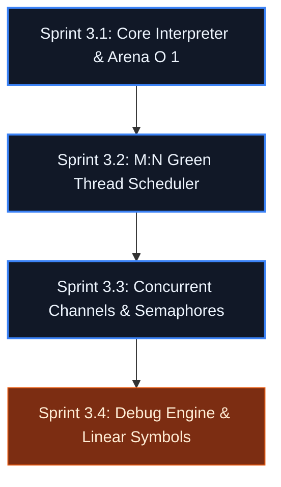

# 🗺️ Incremental Execution Plan: Phase 3 - Virtual Machine & Debugger

---

## 🛠️ Sprint 3.1: The Core Interpreter & Arena Allocator ($O(1)$)
*Goal: Read the compiled `.tkb` file, validate the `TEKO` magic header, and run sequential instructions on a single native thread with contiguous block allocation.*

*   **Code Deliverables (`src/vm_core.c` / `.h`):**
    *   `TekoVM` structure containing the `IP` (Instruction Pointer) register, an array of generic virtual registers, and a pointer to the loaded bytecode.
    *   The main loop executed via `while(true)` using the C23 *computed gotos* technique to maximize opcode dispatch performance instead of a slow switch.
    *   `Arena` structure: A raw `malloc` of one memory page (e.g. 4KB) where all strings and structures allocated at runtime are inserted sequentially via pointer *offset*. Discarding wipes everything instantly.
*   **🧪 Related Unit Test (`tests/test_vm_core.c`):**
    *   Inject structured arithmetic opcodes and validate that the Arena clears 100% of runtime memory in constant $O(1)$ time at the end of execution.

---

## 🔄 Sprint 3.2: The M:N Scheduler & Green Thread Context Switching
*Goal: Implement the language's real async support, allowing the `async` keyword to create lightweight coroutines (M) controlled by a scheduler running on native threads (N).*

*   **Code Deliverables (`src/vm_scheduler.c` / `.h`):**
    *   `GreenThread` structure containing its own register state, local stack, and lifecycle status (`READY`, `RUNNING`, `BLOCKED`, `DEAD`).
    *   Manual *Context Switching* implementation saving and restoring virtual register state without relying on heavy kernel calls.
    *   *Yielding* mechanism: The `OP_SPAWN_ASYNC` opcode suspends the current Green Thread's execution and places the new task in the Scheduler's global ready queue.
*   **🧪 Associated Tests (`tests/test_vm_scheduler.c`):**
    *   Simulate firing 1000 simultaneous Green Threads executing pure computation tasks and check that the scheduler alternates them perfectly without locking up.

---

## 🚦 Sprint 3.3: Synchronous Channels, Bounded Channels, and Synchronization Primitives
*Goal: Bring to life the concurrent operators extracted from the Parser: `chan<T>`, `waiter`, and `mutex`, binding them to the Scheduler's blocking state.*

*   **Code Deliverables (`src/vm_concurrency.c` / `.h`):**
    *   Internal channel structure: thread-safe circular buffer protected by atomic locks if *bounded*, or a linked queue if *unbounded*.
    *   Blocking Synchronization: If a Green Thread executes `OP_CHAN_PUT` (or a read) and the channel is full/empty, the Scheduler changes its status to `BLOCKED` and moves the cursor to the next ready task, eliminating CPU waste from *busy-waiting*.
    *   Coupling of certified native methods: `lock()`, `unlock()`, `add()`, `done()`, `wait()`.
*   **🧪 Associated Tests (`tests/test_vm_channels.c`):**
    *   A producer and a consumer exchanging decimal messages through a channel and validating that the Scheduler manages the blocked Green Threads correctly.

---

## 🐛 Sprint 3.4: Debugging Infrastructure (The Teko Debugger)
*Goal: Add native support for runtime state inspection, allowing the interpreter to be paused, local Arena variable values to be read, and execution to advance instruction by instruction.*

*   **Code Deliverables (`src/vm_debug.c` / `.h`):**
    *   Generation of a linear symbol map at compile time (*Debug Symbols*) associating the physical Bytecode address with the line and column of the original source file.
    *   `Breakpoints` structure: An array of IL memory addresses marked for pause. When the core interpreter loop reaches a registered address, it suspends the Green Thread and enters interactive CLI listening mode.
    *   Debug Engine Control Routines: `vm_debug_step_into()`, `vm_debug_continue()`, and the `vm_debug_inspect_arena()` function to map the Heap in real time.
*   **🧪 Associated Tests (`tests/test_vm_debug.c`):**
    *   Set up a fictional breakpoint via code in Unity, run the interpreter, and validate that the VM state freezes and exposes the registers with mathematical precision.